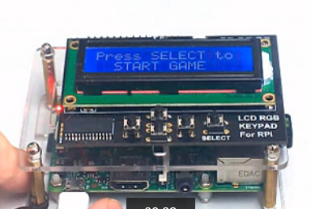
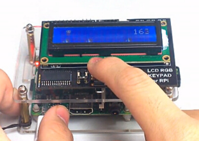

RaspberryPiLCDRunner
====================

A little game for RaspberryPi on Adafruit LCD Plate.

## Prepare

1. 1602LCD Pad (You can buy it from Adafruit or TaoBao)
1. wiringPi `git clone git://git.drogon.net/wiringPi`

## Go!

```
sudo python Display.py
```

## Gallary

  - Just for fun :)
  
    

  - You can wacthing the demo online.
  
    [](http://v.youku.com/v_show/id_XNzc0NjgxNDU2.html?from=y1.7-1.2)
